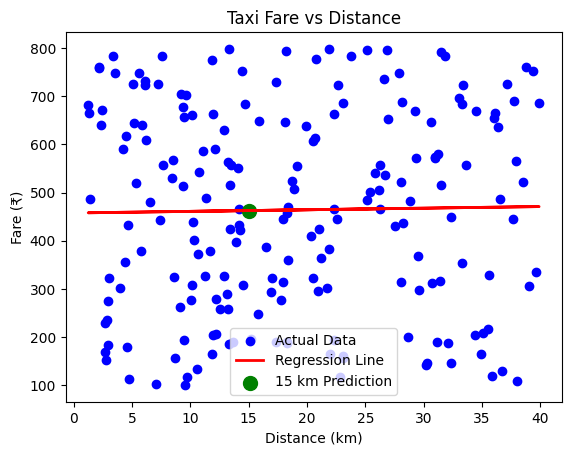
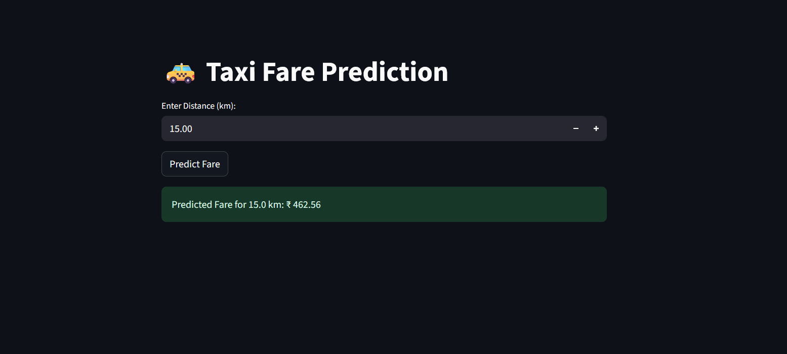

# Taxi Fare Prediction Using Linear Regression

# App Link:** 'https://predicting-taxi-fare-from-distance-iqyjshqvjztz68znu9gvyn.streamlit.app/'

## Overview

This project aims to predict taxi fares in a city using a simple linear regression model. By analyzing the relationship between trip distance and fare, we can estimate the cost of a ride and uncover the existence of a base fare (fixed starting charge). This solution is useful for both passengers and taxi operators to ensure transparency and planning.

## Data Description

- **Source:** `Taxi_Fare.csv`
- **Key Columns:**
  - `Distance_km`: Distance of the trip in kilometers
  - `Fare_Rs`: Fare charged for the trip in Indian Rupees (₹)
- The dataset contains real-world taxi ride records.

## Objectives

- Train a linear regression model to predict the fare for a 15 km trip.
- Determine if there is a base fare (fixed cost/intercept) in the pricing.
- Visualize the relationship between distance and fare.

## Getting Started

### 1. Install Dependencies

```sh
pip install numpy pandas scikit-learn matplotlib
```

### 2. Run the Analysis

- Open the notebook or Python script.
- The script will:
  - Load the dataset
  - Train the regression model
  - Output the predicted fare for 15 km, base fare, and fare per km
  - Plot the data and regression line

### 3. Example Output

```
Predicted fare for 15 km: ₹XXX.XX
Base fare (fixed cost/intercept): ₹XXX.XX
Fare per km (slope): ₹XX.XX
```

A plot will also be displayed showing the data points, regression line, and the 15 km prediction.

## Requirements

- Python 3.x
- numpy
- pandas
- scikit-learn
- matplotlib

## Visualization

The analysis includes a visualization of the data and the regression model:

- 
- Blue dots: Actual taxi rides
- Red line: Regression fit
- Green dot: Predicted fare for 15 km

## 📸 Screenshot:

**🔹Streamlit App**
🔹

## Conclusion

This project demonstrates how linear regression can be used for fare prediction and pricing analysis in urban transport. The approach is easily extendable—adding more features (like time, weather, or traffic) can further improve prediction accuracy and insights.# Predicting-Taxi-Fare-from-Distance